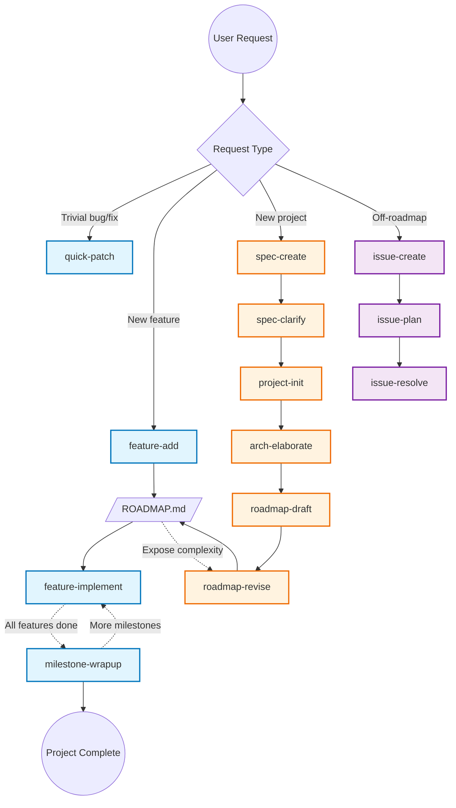

# Yet Another Toolkit

A collection of Claude Code skills for structured software development.

## Overview

This toolkit provides skills for managing the full software development lifecycle:
- Project specification and architecture
- Roadmap planning and feature management
- Implementation with TDD discipline
- Milestone verification

## Skills

### Project Setup

| Skill | Description |
|-------|-------------|
| [spec-create](skills/spec-create/) | Creates or updates project specifications (SPEC.md) |
| [spec-clarify](skills/spec-clarify/) | Resolves ambiguous areas in specifications |
| [project-init](skills/project-init/) | Bootstraps new projects with tech stack selection |
| [arch-elaborate](skills/arch-elaborate/) | Elaborates architecture tree from SPEC.md |
| [roadmap-draft](skills/roadmap-draft/) | Drafts implementation roadmap from features |
| [roadmap-revise](skills/roadmap-revise/) | Transforms features into atomic blocks, restructures milestones |

### Feature Workflow

| Skill | Description |
|-------|-------------|
| [feature-add](skills/feature-add/) | Breaks down features into atomic blocks, adds to roadmap |
| [feature-implement](skills/feature-implement/) | Implements features using test-first development |
| [quick-patch](skills/quick-patch/) | Resolves trivial bugs/fixes with TDD |

### Milestone Workflow

| Skill | Description |
|-------|-------------|
| [milestone-wrapup](skills/milestone-wrapup/) | Verifies milestone completion (self-eval + user presentation) |

### Off-Roadmap (Second-Order)

| Skill | Description |
|-------|-------------|
| [issue-create](skills/issue-create/) | Creates off-roadmap issue documents |
| [issue-plan](skills/issue-plan/) | Creates task roadmap for issues |
| [issue-resolve](skills/issue-resolve/) | Executes issue tasks with batch review |

## Workflow

## Usage

### Starting a New Project

1. `/spec-create <project-description>` - Create SPEC.md
2. `/spec-clarify` - Resolve ambiguities in spec
3. `/project-init` - Bootstrap project with tech stack
4. `/arch-elaborate` - Generate architecture
5. `/roadmap-draft` - Create initial roadmap
6. `/roadmap-revise` - Refine into atomic blocks

### Adding a Feature

1. `/feature-add <feature-description>` - Add to roadmap
2. `/feature-implement` - Implement with TDD
3. Repeat until milestone complete

### Quick Fixes

`/quick-patch <bug-description>` - For trivial fixes (< 30 min)

### Milestone Completion

`/milestone-wrapup [milestone-number]` - Verify and document

## Atomic Transition Blocks

Features are decomposed into atomic blocks with these fields:

- **Trigger**: Event initiating evaluation
- **Precondition**: Condition for action execution
- **State Mutation**: Runtime state changes
- **Persistence Mutation**: Data changes across restarts
- **Observable Response**: UI/API output
- **Invariant Introduced**: Rules that must always hold

This ensures each block has measurable impact and can be tested independently.
